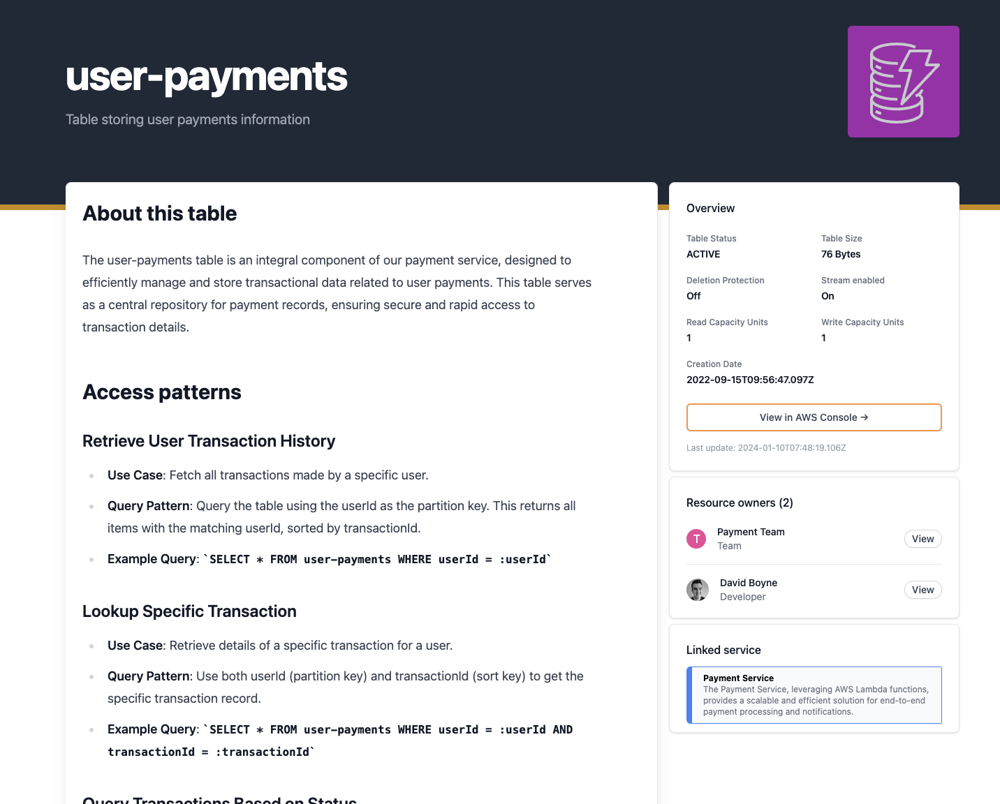

# Documenting

After you [import your DynamoDB tabel](/docs/overview/guides/resources/AWS/DynamoDB/adding-resource) you can start to add documentation to the resource.

The generated markdown file is split into two main parts:

- frontmatter
  - Stores information about the DynamoDB Table.
- markdown 
  - Stores documentation about your DynamoDB Table.

Here is an example of a DynamoDB resource

```mdx
---
name: user-payments
description: Table storing user payments information
service: payment-service
owners:
  - dboyne
  - payment-team
AWS:
  Arn: arn:aws:dynamodb:us-west-2:123456789123:table/user-payments
  TableName: user-payments
  CreationDateTime: '2022-09-15T09:56:47.097Z'
  DeletionProtectionEnabled: false
  TableStatus: ACTIVE
  TableSizeBytes: 76
  StreamSpecification:
    StreamEnabled: true
    StreamViewType: NEW_AND_OLD_IMAGES
  ProvisionedThroughput:
    ReadCapacityUnits: 1
    WriteCapacityUnits: 1
  AttributeDefinitions:
    - AttributeName: id
      AttributeType: S
  Service: dynamodb
  AccountId: 123456789123
catalog:
  updatedAt: '2024-01-10T07:48:19.106Z'
  parent: dynamodb
  path: user-payments
---

## About this table

The user-payments table is an integral component of our payment service, designed to efficiently manage and store transactional data related to user payments. This table serves as a central repository for payment records, ensuring secure and rapid access to transaction details.

```

### Example resource page

Example of what the above resource would render.

