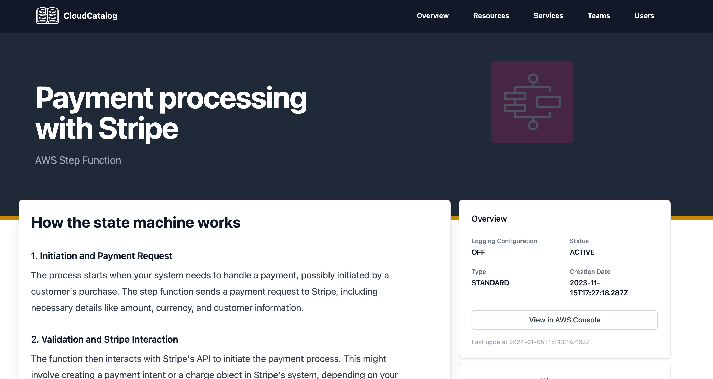

# Importing

Using the `@catalogcloud/cli` you can import state machine directly into your catalog. You will need the `ARN` of the Step Function state machine to import.

:::tip
Run the CloudCatalog CLI within your catalog directory.
:::

### Required permissions

To import a Step Function state machine into the Catalog your AWS credentials will need the following permissions:

- `states:DescribeStateMachine` - [Documentation website](https://docs.aws.amazon.com/step-functions/latest/apireference/API_DescribeStateMachine.html)

### Steps to import

1. Navigate to your CloudCatalog in your terminal
2. Import the Step Function state machine resource into your catalog by running the following command:

```sh
npx @cloudcatalog/cli import-resource {arn}
```

3. Start your CloudCatalog

```sh
npm run dev
```

4. Navigate to the [resources](https://localhost:3000/resources) or [overview](https://localhost:3000/overview) page to see your state machine.

### Example resource page

Here is an example of what an imported State machine function would look like.


