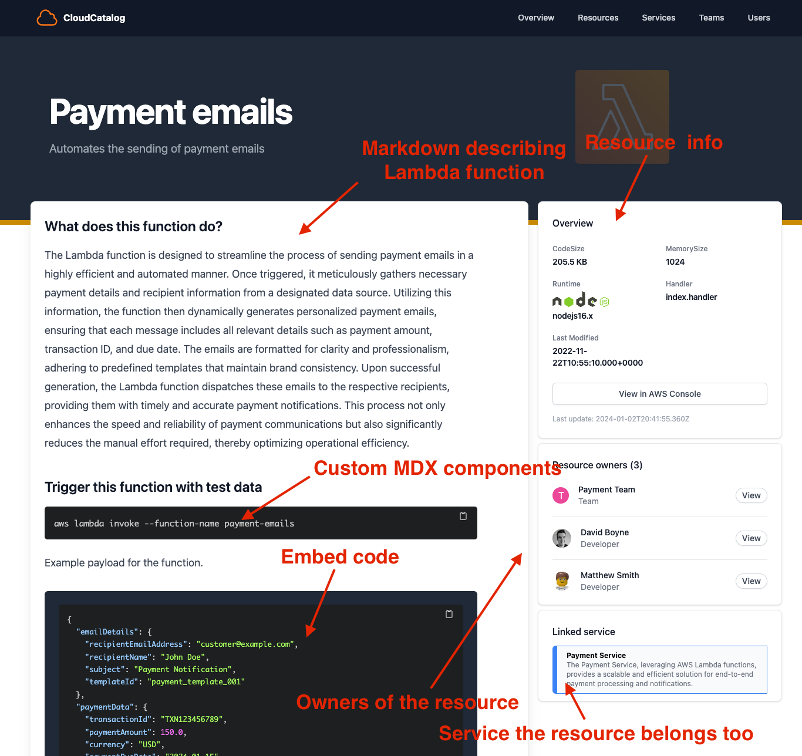

# Introduction

**Resources** are a core part of any AWS Architecture.

### What do resources look like in CloudCatalog?

**CloudCatalog** provides many features when documenting your resources:

- **Code Examples** - Give developers code examples of how to trigger your resource
- **Owners** - Document owners of your events so teams know who owns what
- **Custom Components** - Powered by MDX you can add extra components to your resource pages

Next, let's look at how we can add some Resources.
