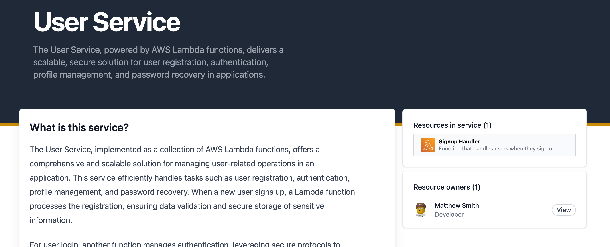

# Adding owners to services

Services can be assigned owners. Owners are either [users](/docs/overview/guides/users/introduction) or [teams](/docs/overview/guides/teams/introduction).

To add **owners** to your service you can add the field **owners** to [your frontmatter](/docs/api/resource-front-matter#owners).

## Example

In the example below we have added three owners to this resource:

- dboyne (user)
- payment-team (team)

```mdx
---
id: user-service
description: The User Service, leveraging AWS Lambda functions.
name: User Service
owners:
  - dboyne
  - paymentTeam
---

### What is this service?

The Payment Service is a sophisticated cloud-based architecture, primarily composed of a suite of AWS Lambda functions, each expertly designed to handle specific aspects of the payment processing lifecycle. This modular approach ensures high scalability, reliability, and efficiency, making it ideal for businesses seeking to streamline their payment operations. The service covers a broad range of functionalities, from initiating and processing transactions to handling confirmations and sending payment-related notifications.
```

CloudCatalog will render the owners to the service page when they are configured. Users can then explore users or teams directly from the resource page.


