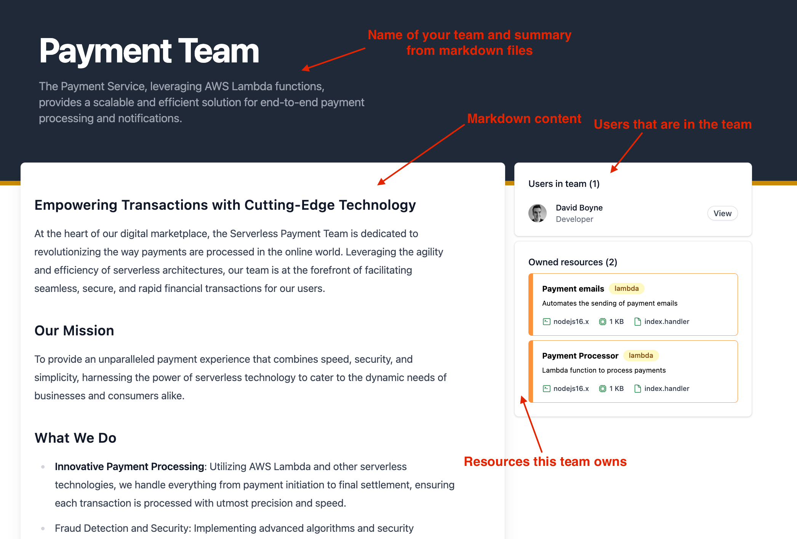

# Introduction

**Teams** can be added to your CloudCatalog. This gives you the ability to groups of [users](/docs/overview/guides/users/introduction), assign teams to own resources and also services.

### What do teams look like in CloudCatalog?

**CloudCatalog** provides many features when documenting your teams:

- **Page** - Each team has it's own page. You can customize this using markdown
- **Ownership** - Assign teams to resources and services. Add users to teams.

Next, let's look at how we can add some Teams.
