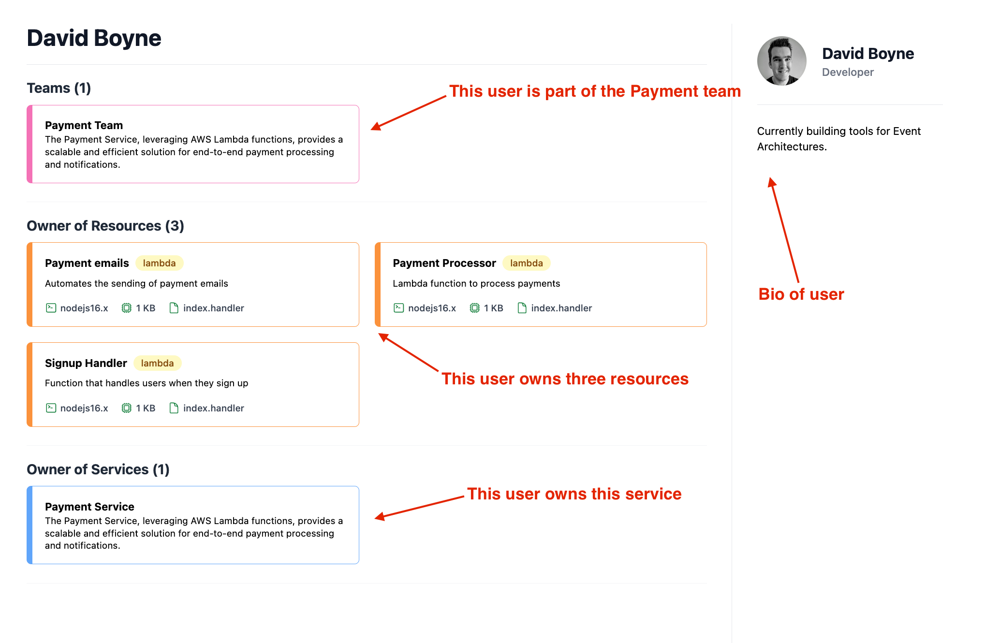

# Introduction

**Users** can be added to your CloudCatalog. This gives you the ability to document your team members, assign them to teams, and also assign them to services and resources.

### What do users look like in CloudCatalog?

**CloudCatalog** provides many features when documenting your users:

- **Bio** - Each user has it's own page, you can customise this and add images and bios.
- **Ownership** - Assign users to teams, resources and services. Let others know who owns what.

Next, let's look at how we can add some Services.
